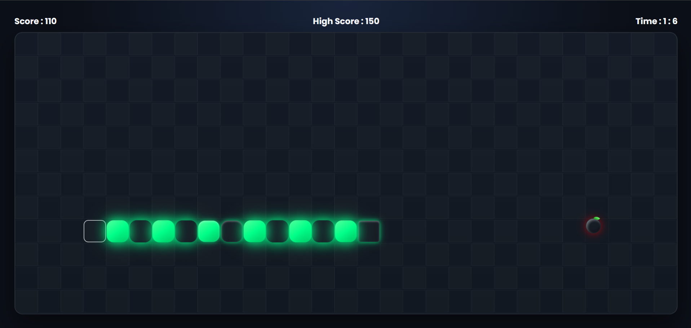

# 🐍 Snake Game

A modern browser-based **Snake Game** built with **HTML, CSS, and JavaScript**. Control the snake, collect food to grow, beat your high score, and survive by avoiding walls and self-collisions.

## 📸 Preview
 



---

## ✨ Features

- 🎮 Classic Snake gameplay
- 🍎 Random food generation
- 🐍 Snake grows after eating food
- 🏆 High score saved with Local Storage
- 📈 Live score & timer
- 🚧 Wall & self-collision detection
- 🚫 Reverse direction prevention
- 🚀 Start & Game Over modals
- 🔄 Restart game functionality
- 🎨 Modern responsive dark UI

---

## 🛠️ Tech Stack

- HTML5
- CSS3
- JavaScript (ES6)
- Local Storage API

---

## 🎮 Controls

| Key | Action |
|------|--------|
| ⬆️ | Move Up |
| ⬇️ | Move Down |
| ⬅️ | Move Left |
| ➡️ | Move Right |


---

## 📂 Project Structure

```text
Snake-Game/
├── index.html
├── style.css
├── script.js
├── assets/
└── README.md
```

---

## 🔮 Future Improvements

- Difficulty levels
- Sound effects
- Mobile controls
- Pause & Resume

---

## 👨‍💻 Author

**Subhajit Mondal**

⭐ If you like this project, consider giving it a star!